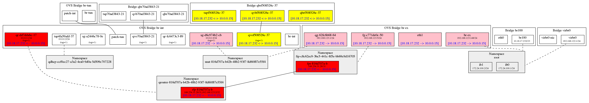

# OVSImager

OVSImager draws a graph that describes relationship among Open vSwitch
bridges, Linux bridges, and namespaces for routing. It can also mark
the ports where ping packets went through using tcpdump, which is a
useful feature for trouble-shooting in SDN environments.

## Installation

    $ gem install ovsimager
    # sudo yum install graphviz

## Usage

### Draw a graph of Open vSwitch'es

    $ ovsimager
    ( => interfaces.png will be generated. )

### Trace ping packets

- Execute ping packet with size = 400 byte
    $ ping -s 400 192.0.2.1
    $ sudo ovsimager -d
    ( => interfaces.png will be generated. )

- Or ovsimager also can send ping
    $ sudo ovsimager -d -f 10.0.0.1 -t 192.0.2.1

## Contributing

1. Fork it ( https://github.com/NeoCat/ovsimager/fork )
2. Create your feature branch (`git checkout -b my-new-feature`)
3. Commit your changes (`git commit -am 'Add some feature'`)
4. Push to the branch (`git push origin my-new-feature`)
5. Create a new Pull Request
